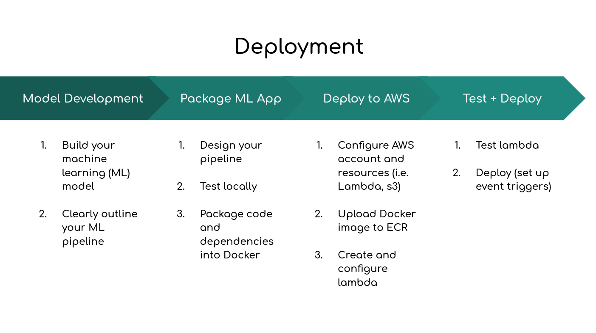

# Deploy Anomalib to AWS (Model)

## Setup

Make sure you have [conda](https://docs.conda.io/en/latest/miniconda.html) installed. Then, install the requirements with `bash install_requirements.sh`.

## Prepare MVTEC Data
`python datasets/prepare_data.py`

## Download pre-trained Padim models
Unzip Padim models (including meta-data) to the folder `results/`.

You need to put the following files in the folder `results/`:
- `results/padim/mvtec/bottle/openvino/model.bin`
- `results/padim/mvtec/bottle/openvino/meta_data.json`

## Gradio Inference (Local)
`python tools/inference/gradio_inference.py --config tools/config/padim/config.yaml --weights results/padim/mvtec/bottle/openvino/model.bin --meta_data results/padim/mvtec/bottle/openvino/meta_data.json`

## Deployment

1.  Create/setup a AWS account
2.  Register an image repo on AWS ECR. 
3.  Upload your Docker image to AWS Elastic Container Registry (ECR)
    - docker login
    - docker build -t 
    - docker tag
    - docker push
4.  Create your AWS Lambda to run the ECR image
    - Create the Lambda function with pushed image
    - Config max memory usage and timeout
    - Create a test 
    - Add a triger
5. Run the frontend in a seperate ec2 instance.

## Demo
[Demo](https://drive.google.com/file/d/1A9YMMY8CdCqZtiUOYUwuB8pgPC8zEHkG/view?usp=sharing) 
